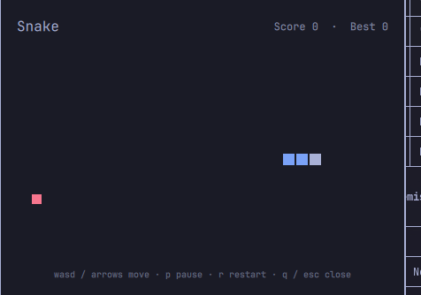

# Snake

A small, semi-transparent Snake overlay for [Omarchy](https://omarchy.org/) (Quattro). Pop it open with a hotkey while you're waiting on something — a build, a long-running agent, whatever — and close it again without losing your run.



- Small and centered, not fullscreen — whatever's behind it stays visible.
- Colors come straight from the shell's live theme singleton (`Color.accent`, `Color.urgent`, the `menu` surface), so it always matches your current Omarchy theme and repaints instantly if you switch themes while it's open.
- State survives closing the overlay — reopen it and your run, score, and difficulty pick up where you left off. Restart anytime with `r` after a game over.
- Stays on the workspace it was opened on — switch workspaces and it auto-hides instead of floating on top of wherever you went; summon it again there if you want it.
- Adjustable base speed (`+`/`-`), independent of the per-food speed-up ramp within a run.

This is a Quickshell **overlay plugin** for the Omarchy shell (`omarchy-shell`) — it runs inside the same long-running shell process as the bar, menu, emoji picker, etc. It is not a standalone app.

## Requirements

Omarchy on the Quattro branch (the Quickshell-based shell with a plugin marketplace at [plugins.omarchy.org](https://plugins.omarchy.org)).

## Install

```bash
omarchy plugin add https://github.com/LennartAI/omarchy-snake.git --enable --yes
```

This clones the plugin into `~/.config/omarchy/plugins/io.github.lennartai.snake/` and enables it. Since plugins run unsandboxed inside `omarchy-shell`, review `Snake.qml` before enabling if you'd rather not take that on faith.

### Bind a hotkey

Installing the plugin does not add a keybinding — wire one up in `~/.config/hypr/bindings.lua`:

```lua
o.bind("SUPER + CTRL + ALT + N", "Snake", "omarchy-shell shell toggle io.github.lennartai.snake '{}'")
```

Pick whatever key combo you like; check it's free first with `omarchy menu keybindings --print`.

## Controls

| Key | Action |
|---|---|
| `wasd` / arrow keys | move |
| `+` / `-` | speed up / slow down |
| `p` | pause / resume |
| `r` | restart (after game over) |
| `q` / `Esc` | close the overlay |

Clicking outside the card also closes it.

## Uninstall

```bash
omarchy plugin remove io.github.lennartai.snake --yes
```

Then remove the keybinding you added in `bindings.lua`.

## Update

```bash
omarchy plugin update io.github.lennartai.snake
```

If the overlay was already open/loaded in this shell session before updating, run `omarchy restart shell` afterwards. Quickshell's hot-reload for `keepLoaded` overlay plugins recompiles the file but doesn't always apply structural changes (new properties, new bindings) to the already-mounted instance — a full shell restart guarantees a clean load. A plain reinstall/first install doesn't need this, since there's no stale instance yet.

## License

MIT — see [LICENSE](LICENSE).
